#  Oleg Yakushev | Backend Engineer

<div align="center">
  
</div>

<div align="center">
  &nbsp;
  &nbsp;
  &nbsp;
  &nbsp;
  &nbsp;
</div>

---

🚀 About Me
```go
package main

import (
    "fmt"
    "time"
)

type BackendEngineer struct {
    Name        string
    Role        string
    Location    string
    Age         int
    Experience  string
    Languages   []string
    Stack       map[string][]string
    Learning    []string
}

func NewBackendEngineer() *BackendEngineer {
    return &BackendEngineer{
        Name:       "Oleg Yakushev",
        Role:       "Backend Engineer",
        Location:   "Earth, Solar System",
        Age:        20,
        Experience: "2+ years",
        Languages:  []string{"Python", "Go", "C#"},
        Stack: map[string][]string{
            "frameworks":      {"FastAPI", "Django", "Flask"},
            "databases":       {"PostgreSQL", "MongoDB", "ClickHouse"},
            "message_brokers": {"RabbitMQ", "Apache Kafka"},
            "devops":          {"Docker", "Nginx", "Linux", "Git"},
        },
        Learning: []string{"Go", "System Design", "High Load Systems"},
    }
}

func main() {
    me := NewBackendEngineer()
    fmt.Printf("👋 Welcome to %s's profile!\n", me.Name)
}
```

## 🛠️ Tech Stack

<div align="center">

### Languages


### Frameworks & Libraries


### Databases


### DevOps & Tools


### Message Brokers


</div>

## 💼 Professional Experience

### 🏢 СМК-РК | Python Developer
**📅 Sep 2024 - Nov 2025 (1 years 3 months)**
- 🚀 Designing and developing new microservices architecture
- 🔧 Maintaining and refactoring legacy systems
- 👨‍💻 Conducting thorough code reviews
- 📈 Mentoring and training junior team members

### 🏢 Finservlab | Backend Developer
**📅 Aug 2023 - Sep 2024 (1 years 2 months)**
- 🆕 Built a new service from scratch using Python
- 💻 Developed features for large-scale C# projects
- 🏗️ Contributed to microservices architecture design

## 🎯 Current Focus

```mermaid
graph TD
    A[🎯 Current Learning Goals] --> B[Go Programming]
    A --> C[System Design]
    A --> D[High Load Systems]
    B --> E[Building Microservices in Go]
    C --> F[Scalable Architecture Patterns]
    D --> G[Performance Optimization]
```

<div align="center">



</div>

## 🎓 Education

**🏛️ Moscow Technical University of Communications and Informatics**  
*Bachelor's Degree in IT*

## 🌐 Languages

- 🇷🇺 **Russian** - Native
- 🇺🇸 **English** - B1 (Intermediate)

## 💡 Fun Facts

- 🚀 I led my first IT-team on a project during my first year of university (I was 17 years old).
- 📷 In my free time, I am a film photographer with a small but cozy public: https://t.me/@ForgottenPhotocards
- 🖼️ Love art, especially exhibitions in art galleries
- 🥊 I am passionate about boxing, mixed martial arts, and the gym
- And... glad u read it!)

## 📫 Let's Connect!

<div align="center">

[](mailto:oleg.yakushev.work@gmail.com)
[](https://t.me/brikoz)
[743--12--73-green?style=for-the-badge&logo=whatsapp&logoColor=white)](tel:+79857431273)

</div>

<div align="center">
  
  
  <h3>💖 Thanks for visiting my profile!</h3>
  <p>⭐️ Feel free to star any repositories you find interesting!</p>
</div>

<div align="center">
  
</div>
